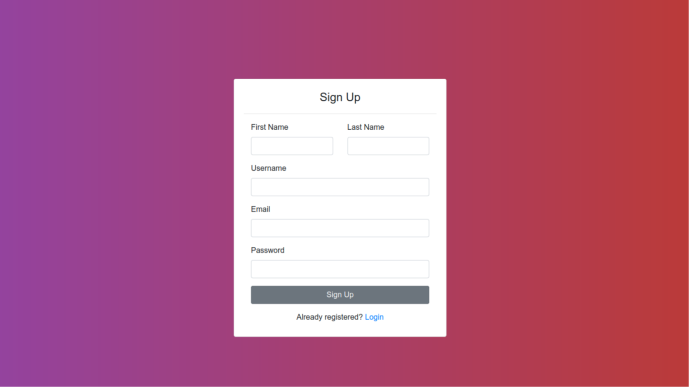
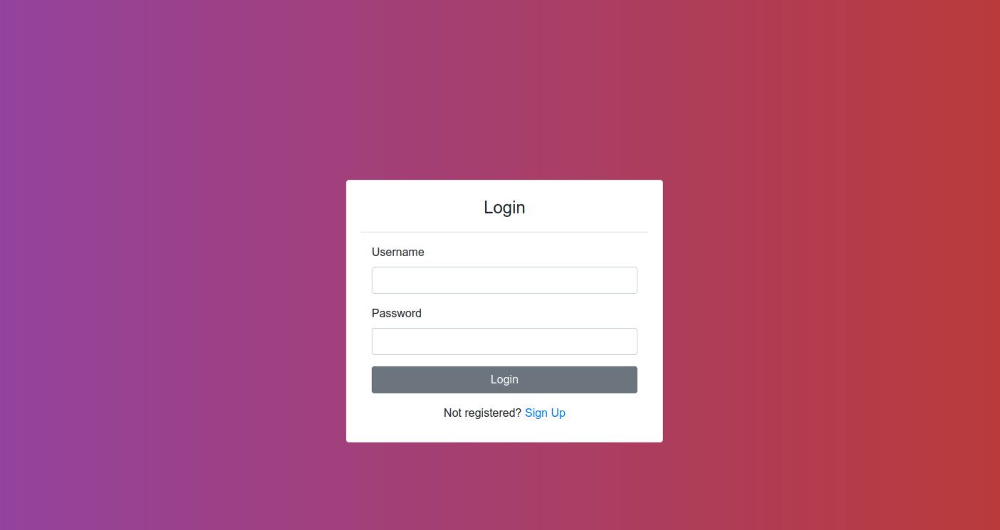
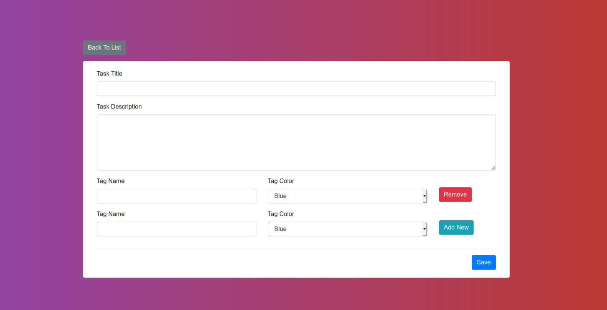
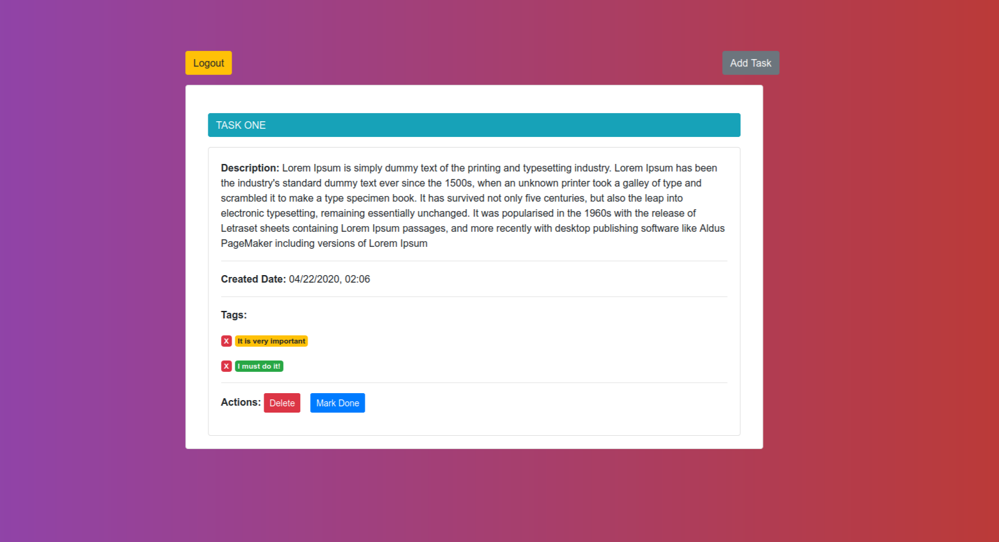

# Contents

 - Django Rest Framework
 - React Js
 - Redux
 - PostgreSQL

# Installation with docker
  Clone project

    $ https://github.com/kamilyrb/Todo-App-DRF-and-ReactJs.git

  In root directory build and up docker images

    $ docker-compose up --build

# App ScreenShots

